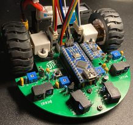

<!-- PROJECT LOGO -->
 

  
  <h3 align="center">UTEP IEEE Micromouse</h3>
   

     UTEP IEEE Micromouse project repository
      
     <a href="workshops/Intro to micromouse presentation.pdf"><strong>See intro presentation</strong></a>
      
  

<!-- TABLE OF CONTENTS -->

  
Table of Contents

  <ol>
    <li><a href="#about-the-project">About The Project</a></li>
    <li><a href="#contributing">Contributing</a></li>
    <li><a href="#license">License</a></li>
    <li><a href="#contact">Contact</a></li>
    <li><a href="#acknowledgments">Acknowledgments</a></li>
  </ol>

<!-- ABOUT THE PROJECT -->
## About The Project
 

  

(<a href="#top">back to top</a>)

<!-- CONTRIBUTING -->
## Contributing

(<a href="#top">back to top</a>)

<!-- LICENSE -->
## License

Distributed under the MIT License. See `LICENSE.txt` for more information.

(<a href="#top">back to top</a>)

<!-- CONTACT -->
## Contact

Alejandro Martinez Acosta - amartinezacosta@miners.utep.edu

Project Link: [https://github.com/amartinezacosta/UTEP-IEEE-Micromouse](https://github.com/amartinezacosta/UTEP-IEEE-Micromouse)

(<a href="#top">back to top</a>)

<!-- ACKNOWLEDGMENTS -->
## Acknowledgments

(<a href="#top">back to top</a>)
