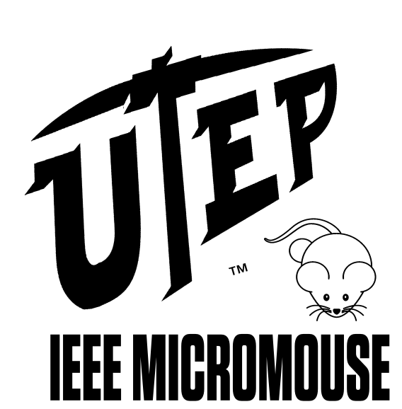

<!-- PROJECT LOGO -->
 

  
  <h3 align="center">UTEP IEEE Micromouse</h3>
   

     UTEP IEEE Micromouse project repository
      
     <a href="workshops/Intro to micromouse presentation.pdf"><strong>See intro presentation</strong></a>
      
  

<!-- TABLE OF CONTENTS -->

  
Table of Contents

  <ol>
    <li><a href="#about-the-project">About The Project</a></li>
    <li><a href="#contributing">Contributing</a></li>
    <li><a href="#license">License</a></li>
    <li><a href="#contact">Contact</a></li>
    <li><a href="#acknowledgments">Acknowledgments</a></li>
  </ol>

<!-- ABOUT THE PROJECT -->
## About The Project
 

  IEEE UTEP Micromouse repository where you can find template code, schematics and workshops
  to build and get your mouse working. This repository was designed to be used with the micromouse
  kit shown in the schematics folder. The workshops will guide you through the necessary code to 
  have your mouse solving a micromouse maze.
  
  Take a look at:
  
  - [Schematics](micromouse_arduino_nano_kit/Micromouse_Arduino_Nano.pdf)
  - [Workshops](workshops/)
  - [Code](code_template/)

(<a href="#top">back to top</a>)

<!-- CONTRIBUTING -->
## Contributing

To contribute, please fork the project and send a pull request or talk to any of the UTEP IEEE officers. For any other questions please use the contact info at the bottom to contact the owner of this repository.

(<a href="#top">back to top</a>)

<!-- LICENSE -->
## License

Distributed under the MIT License. See `LICENSE.txt` for more information.

(<a href="#top">back to top</a>)

<!-- CONTACT -->
## Contact

Alejandro Martinez Acosta - amartinezacosta@miners.utep.edu

Project Link: [https://github.com/amartinezacosta/UTEP-IEEE-Micromouse](https://github.com/amartinezacosta/UTEP-IEEE-Micromouse)

(<a href="#top">back to top</a>)

<!-- ACKNOWLEDGMENTS -->
## Acknowledgments
[University of Texas at El Paso](https://www.utep.edu/)

[IEEE University of Texas at El Paso branch](https://edu.ieee.org/us-utep/)

(<a href="#top">back to top</a>)

